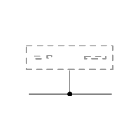
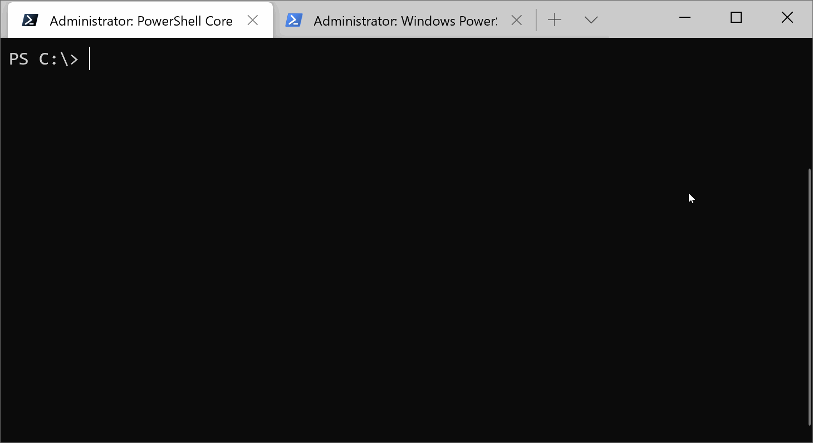

Pretendpoint
============

<!-- To publish to PowerShell Gallery: dotnet build -t:PublishModule -c Release -->

Pretend Endpoint, the disposable web server.
A set of PowerShell cmdlets to create an HTTP test server/endpoint for inspecting or debugging client requests.

Cmdlets
-------

Documentation is automatically generated using [platyPS](https://github.com/PowerShell/platyPS).

- [Get-WebRequestBody](docs/Get-WebRequestBody.md) &mdash;
  Starts an HTTP listener to receive a single request, whose body is returned, supporting static or dynamic respnoses.
- [Read-WebRequest](docs/Read-WebRequest.md) &mdash;
  Parses an HTTP listener request.
- [Receive-HttpContext](docs/Receive-HttpContext.md) &mdash;
  Listens for an HTTP request and returns an HTTP request & response.
- [Restart-HttpListener](docs/Restart-HttpListener.md) &mdash;
  Stops and restarts an HTTP listener.
- [Start-HttpListener](docs/Start-HttpListener.md) &mdash;
  Ports on the localhost to bind to.
- [Stop-HttpListener](docs/Stop-HttpListener.md) &mdash;
  Closes an HTTP listener.
- [Suspend-HttpListener](docs/Suspend-HttpListener.md) &mdash;
  Pauses an HTTP listener.
- [Write-WebResponse](docs/Write-WebResponse.md) &mdash;
  Sends a text or binary response body to the HTTP listener client.

Tests
-----

Tests are written for [Pester](https://github.com/Pester/Pester).

To run the tests, run `dotnet build -t:pester`.
