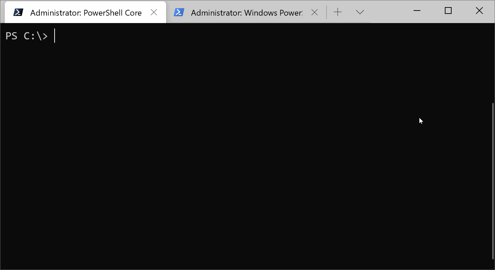

Pretendpoint
============

Pretend Endpoint, the disposable web server.
A set of PowerShell cmdlets to create an HTTP test server/endpoint for inspecting or debugging client requests.

To install: `Install-Module Pretendpoint`

Cmdlets
-------

Documentation is automatically generated using [platyPS](https://github.com/PowerShell/platyPS) (`.\doc.cmd`).

- [Get-WebRequestBody](https://github.com/brianary/Pretendpoint/wiki/Get-WebRequestBody) &mdash;
  Starts an HTTP listener to receive a single request, whose body is returned, supporting static or dynamic respnoses.
- [Read-WebRequest](https://github.com/brianary/Pretendpoint/wiki/Read-WebRequest) &mdash;
  Parses an HTTP listener request.
- [Receive-HttpContext](https://github.com/brianary/Pretendpoint/wiki/Receive-HttpContext) &mdash;
  Listens for an HTTP request and returns an HTTP request & response.
- [Restart-HttpListener](https://github.com/brianary/Pretendpoint/wiki/Restart-HttpListener) &mdash;
  Stops and restarts an HTTP listener.
- [Start-HttpListener](https://github.com/brianary/Pretendpoint/wiki/Start-HttpListener) &mdash;
  Ports on the localhost to bind to.
- [Stop-HttpListener](https://github.com/brianary/Pretendpoint/wiki/Stop-HttpListener) &mdash;
  Closes an HTTP listener.
- [Suspend-HttpListener](https://github.com/brianary/Pretendpoint/wiki/Suspend-HttpListener) &mdash;
  Pauses an HTTP listener.
- [Write-WebResponse](https://github.com/brianary/Pretendpoint/wiki/Write-WebResponse) &mdash;
  Sends a text or binary response body to the HTTP listener client.

Tests
-----

Tests are written for [Pester](https://github.com/Pester/Pester) (`.\test.cmd`).
